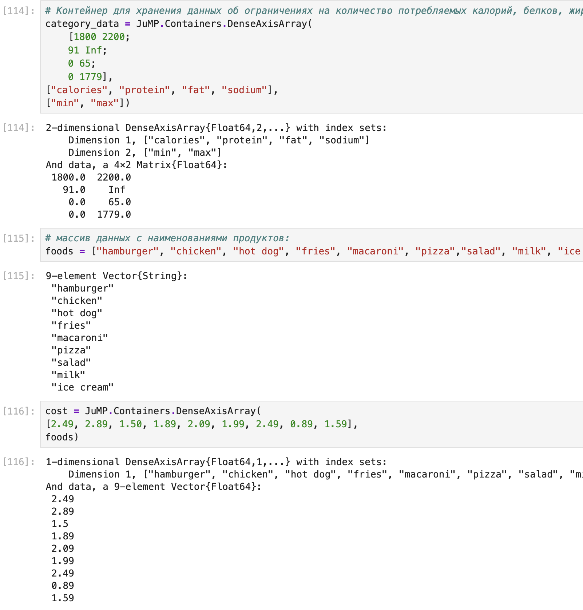
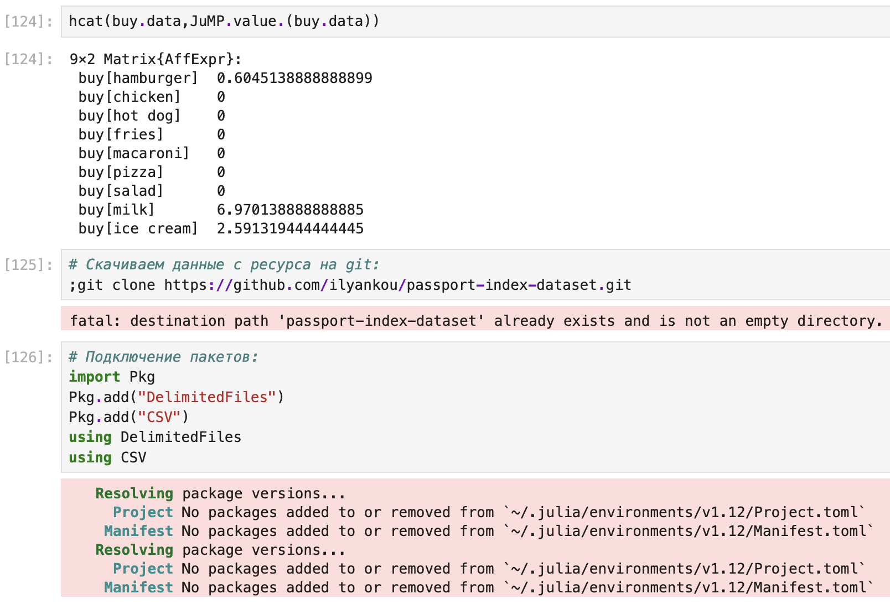
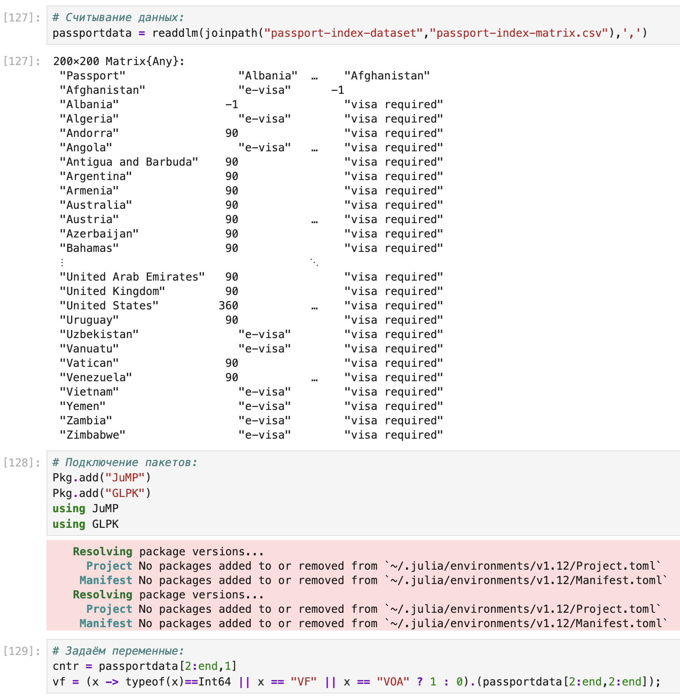
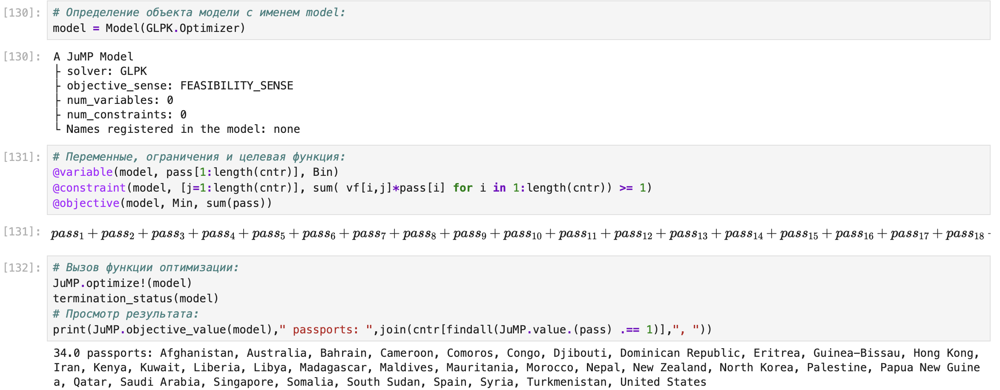
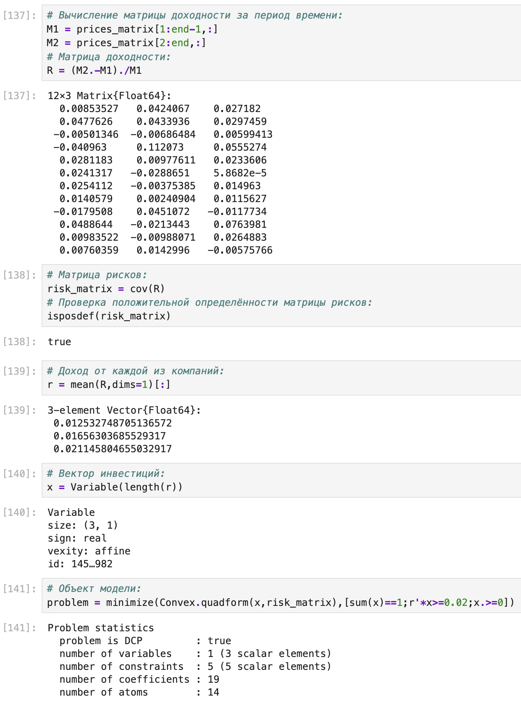
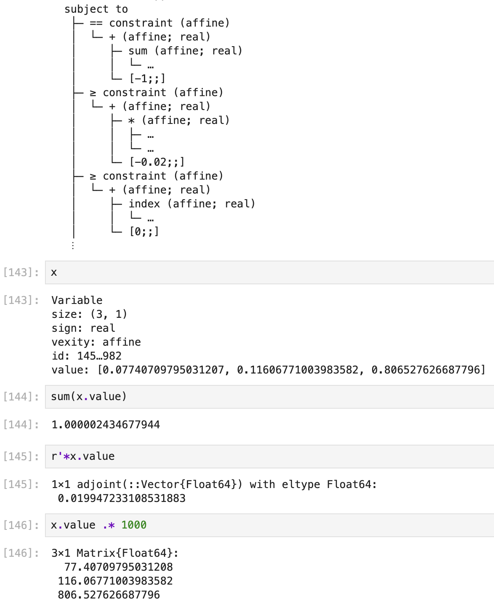
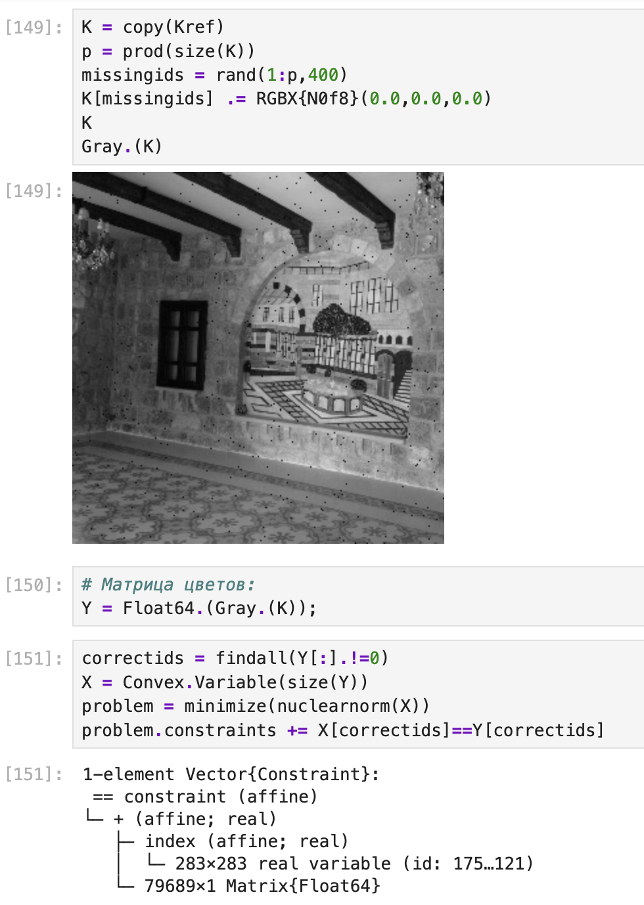

---
## Author
author:
  name: Поляков Глеб Сергеевич
  affiliation:
    - name: Российский университет дружбы народов
      country: Российская Федерация
      postal-code: 117198
      city: Москва
      address: ул. Миклухо-Маклая, д. 6

## Title
title: "Лабораторная работа №8"
subtitle: "Оптимизация"
license: "CC BY"
---

# Цель работы

Основная цель работы—освоить пакеты Julia для решения задач оптимизации.

# Задание

1. Используя Jupyter Lab, повторите примеры из раздела 8.2.
2. Выполните задания для самостоятельной работы (раздел 8.4).

# Выполнение лабораторной работы

Линейное программирование рассматривает решения экстремальных задач на множествах 𝑛-мерного векторного пространства, задаваемых системами линейных уравнений и неравенств.
Общей (стандартной) задачей линейного программирования называется задача нахождения минимума линейной целевой функции вида:
    𝑓( ⃗𝑥) = 𝑛 ∑ 𝑗=1 𝑐𝑗𝑥𝑗, где ⃗𝑐 — некоторые коэффициенты, ⃗𝑥 ∈ ℝ𝑛.
Основной задачей линейного программирования называется задача, в которой есть ограничения в форме неравенств:
    𝑛 ∑ 𝑗=1 𝑎𝑖𝑗𝑥𝑗 ⩾ 𝑏𝑖 , 𝑖 = 1, 2, … , 𝑚, 𝑥𝑗 ⩾ 0, 𝑗 = 1, 2, … , 𝑛.
Задачи линейного программирования со смешанными ограничениями, такими как равенства и неравенства, с наличием переменных, свободных от ограничений, могут быть сведены к эквивалентным с тем же множеством решений путём замены переменных и замены равенств на пару неравенств.
В Julia есть несколько средств, предназначенных для решения оптимизационных задач.
Одним из таких средств является JuMP (https://jump.dev/) — язык моделирования и вспомогательные пакеты для формулирования и решения задач математической оптимизации в Julia.
JuMP включает пакет Convex.jl (https://jump.dev/Convex.jl/stable/), позволяющий описать задачу оптимизации, используя естественный математический синтаксис, и решать её с помощью одного из решателей (COSMO, ECOS, SCS, GLPK, MathOptInterface).
Предположим, что требуется решить следующую задачу линейного программирования:
    12𝑥 + 20𝑦 → min
при заданных ограничениях:
    6𝑥 + 8𝑦 ⩾ 100, 7𝑥 + 12𝑦 ⩾ 120, 𝑥 ⩾ 0, 𝑦 ⩾ 0.
Воспользуемся JuMP и решателем линейного и смешанного целочисленного программирования GLPK:
* Подключение пакетов:
    import Pkg
    Pkg.add("JuMP")
    Pkg.add("GLPK")
    using JuMP
    using GLPK
Объект модели (контейнер для переменных, ограничений, параметров решателя и т. д.) в JuMP создаётся при помощи функции Model(), в которой в качестве аргумента указывается оптимизатор (решатель):
* Определение объекта модели с именем model:
    model = Model(GLPK.Optimizer)
Переменные задаются с помощью конструкции @variable (имя объекта модели, имя и привязка переменной, тип переменной). Здесь же задаются граничные условия на переменные (если тип переменной не определён, он считается действительным):
* Определение переменных x, y и граничных условий для них:
    @variable(model, x >= 0)
    @variable(model, y >= 0)
В качестве первого аргумента указан объект модели model, затем переменные 𝑥 и 𝑦, связанные с этой моделью (причём указанные переменные не могут использоваться в другой модели).
Ограничения модели задаются с помощью конструкции @constraint (имя объекта модели, ограничение):
* Определение ограничений модели:
    @constraint(model, 6x + 8y >= 100)
    @constraint(model, 7x + 12y >= 120)
{#fig-001 width=70%}
Далее следует задать собственно целевую функцию с помощью конструкции
    @objective (имя объекта модели, Min или Max, функция для оптимизации):
* Определение целевой функции:
    @objective(model, Min, 12x + 20y)
Для решения задачи оптимизации необходимо вызывать функцию оптимизации:
* Вызов функции оптимизации:
    optimize!(model)
Следует проверять причину прекращения работы оптимизатора, используя конструкцию    termination_status(Объект модели):
* Определение причины завершения работы оптимизатора:
    termination_status(model)
Процесс решения мог быть прекращён по ряду причин. Во-первых, решатель мог найти оптимальное решение или доказать, что проблема невозможна. Однако он также мог столкнуться с численными трудностями или прерваться из-за таких настроек, как ограничение по времени. Если возвращено значение OPTIMAL, найдено оптимальное решение.
Наконец, можно посмотреть собственно результат решения оптимизационной задачи:
* Демонстрация первичных результирующих значений переменных x и y:
    @show value(x);
    @show value(y);
* Демонстрация результата оптимизации:
    @show objective_value(model);
{#fig-002 width=70%}
## 8.2.2. Векторизованные ограничения и целевая функция оптимизации
Часто бывает полезно создавать коллекции переменных JuMP внутри более сложных
структур данных. Можно добавить ограничения и цель в JuMP, используя векторизованную линейную алгебру.
Предположим, что требуется решить следующую задачу:
⃗𝑐 𝑇  ⃗𝑥 → min
при заданных ограничениях:
𝐴 ⃗𝑥 = ⃗𝑏, ⃗𝑥 ⪰ 0, ⃗𝑥 ∈ ℝ, где 𝐴 = ⎛⎜ ⎝
1 1 9 5
3 5 0 8
2 0 6 13
⎞⎟
⎠
, ⃗𝑏 = ⎛⎜ ⎝
7
3
5
⎞⎟
⎠
, ⃗𝑐 =
⎛⎜⎜⎜⎜
⎝
1
3
5
2
⎞⎟⎟⎟⎟
⎠
.
{#fig-003 width=70%}
Воспользуемся JuMP и решателем линейного и смешанного целочисленного программирования GLPK:
* Подключение пакетов:
    import Pkg
    Pkg.add("JuMP")
    Pkg.add("GLPK")
    using JuMP
    using GLPK
Определим объект модели:
* Определение объекта модели с именем vector_model:
    vector_model = Model(GLPK.Optimizer)
Зададим исходные значения матрицы 𝐴 и векторов ⃗𝑏, :⃗𝑐
* Определение начальных данных:
    A= [ 1 1 9 5;
    3 5 0 8;
    2 0 6 13]
    b = [7; 3; 5]
    c = [1; 3; 5; 2]
Далее зададим массив переменных для компонент вектора :⃗𝑥
* Определение вектора переменных:
    @variable(vector_model, x[1:4] >= 0)
Затем зададим ограничения в соответствии с условиями модели:
* Определение ограничений модели:
    @constraint(vector_model, A * x .== b)
Далее зададим целевую функцию:
* Определение целевой функции:
    @objective(vector_model, Min, c' * x)
{#fig-004 width=70%}
Наконец, для решения задачи оптимизации вызовем функцию оптимизации:
* Вызов функции оптимизации:
    optimize!(vector_model)
Проверим, что найдено оптимальное решение:
* Определение причины завершения работы оптимизатора:
    termination_status(vector_model)
Посмотрим результат решения оптимизационной задачи:
* Демонстрация результата оптимизации:
    @show objective_value(vector_model);
## 8.2.3. Оптимизация рациона питания
В некоторых задачах требуется использование массивов, в которых индексы не являются целыми диапазонами с отсчётом от единицы. Например, требуется использовать переменную, индексируемую по названию продукта или местоположению. Тогда необходимо в качестве индекса использовать произвольный вектор. В Julia это можно реализовать с помощью DenseAxisArrays.
Рассмотрим применение DenseAxisArrays на примере решения задачи оптимизации рациона питании в заведении быстрого питания при условии, что задано ограничение на количество потребляемых калорий (1800–2200), белков (⩾ 91), жиров (0–65) и соли (0–1779), а также перечень определённых продуктов питания с указанием их стоимости — гамбургер (2.49 ден.ед.), курица (2.89 ден.ед.), сосиска в тесте (1.50 ден.ед.), жареный картофель (1.89 ден.ед.), макароны (2.09 ден.ед.), пицца (1.99 ден.ед.), салат (2.49 ден.ед.), молочный коктейль (0.89 ден.ед.), мороженное (1.59 ден.ед.). Также известно содержание калорий, белков, жиров и соли в указанных продуктах.
{#fig-005 width=70%}
Содержание калорий, белков, жиров и соли в продуктах питания

Таблица 8.1
| Продукт           | Калории | Белки | Жиры | Соль |
|-------------------|-----|----|-----|------|
| Гамбургер         | 10  | 24 | 26  | 730  |
| Курица            | 420 | 32 | 10  | 1190 |
| Сосиска в тесте   | 560 | 20 | 32  | 1800 |
| Жареный картофель | 380 | 4  | 19  | 270  |
| Макароны          | 320 | 12 | 10  | 930  |
| Пицца             | 320 | 31 | 12  | 820  |
| Салат             | 320 | 31 | 12  | 1230 |
| Молочный коктейль | 100 | 8  | 2.5 | 125  |
| Мороженное        | 330 | 8  | 10  | 180  |

Воспользуемся JuMP и решателем линейного и смешанного целочисленного программирования GLPK :
* Подключение пакетов:
import Pkg
    Pkg.add("JuMP")
    Pkg.add("GLPK")
    using JuMP
    using GLPK
Создадим контейнер JuMP для хранения информации об ограничениях (минимальное, максимальное) на количество потребляемых калорий, белков, жиров и соли:
* Контейнер для хранения данных об ограничениях на количество потребляемых калорий, белков, жиров и соли:
    category_data = JuMP.Containers.DenseAxisArray(
    [1800 2200;
    91 Inf;
    0 65;
    0 1779],
    ["calories", "protein", "fat", "sodium"],
    ["min", "max"])
{#fig-006 width=70%}

Введём массив данных с наименованиями продуктов:
* массив данных с наименованиями продуктов:
    foods = ["hamburger", "chicken", "hot dog", "fries", "macaroni", "pizza","salad", "milk", "ice cream"]
Введём данные о стоимости продуктов:
* Массив стоимости продуктов:
    cost = JuMP.Containers.DenseAxisArray(
    [2.49, 2.89, 1.50, 1.89, 2.09, 1.99, 2.49, 0.89, 1.59],
    foods)
Введём сведения о содержании калорий, белков, жиров и соли в продуктах питания:
* Массив данных о содержании калорий, белков, жиров и соли в продуктах питания:
    food_data = JuMP.Containers.DenseAxisArray(
    [410 24 26 730;
    420 32 10 1190;
    560 20 32 1800;
    380 4 19 270;
    320 12 10 930;
    320 15 12 820;
    320 31 12 1230;
    100 8 2.5 125;
    330 8 10 180],
    foods,
    ["calories", "protein", "fat", "sodium"])
{#fig-007 width=70%}
Определим объект модели:
* Определение объекта модели с именем model:
    model = Model(GLPK.Optimizer)
Определим массив:
* Определим массив:
    categories = ["calories", "protein", "fat", "sodium"]
Далее зададим переменные:
* Определение переменных:
    @variables(model, begin
    category_data[c, "min"] <= nutrition[c = categories] <= category_data[c, "max"]
* Сколько покупать продуктов:
    buy[foods] >= 0
    end)
Задаём целевую функцию минимизации цены:
* Определение целевой функции:
    @objective(model, Min, sum(cost[f] * buy[f] for f in foods))
Затем зададим ограничения в соответствии с условиями модели:
* Определение ограничений модели:
    @constraint(model, [c in categories],
    sum(food_data[f, c] * buy[f] for f in foods) == nutrition[c]
Наконец, для решения задачи оптимизации вызовем функцию оптимизации:
* Вызов функции оптимизации:
    JuMP.optimize!(model)
    term_status = JuMP.termination_status(model)
Для просмотра результата решения модно вывести значение переменной buy:
    hcat(buy.data,JuMP.value.(buy.data))
{#fig-008 width=70%}
В результате оптимальным по цене и пищевой ценности будет предложено купить гамбургер, молочный коктейль и мороженное.
## 8.2.4. Путешествие по миру
Рассмотрим решение задачи определения оптимального числа паспортов, требующихся, чтобы объехать весь мир. При этом будем учитывать сведения о паспортах и ограничениях, указанных на ресурсе https://www.passportindex.org/. В табличной форме данные можно получить с ресурса https://github.com/ilyankou/passport-index-dataset. Для решения задачи представляют интерес данные, указанные в файле passport-index-matrix.csv, в котором в первым столбце (Passport) указана страна отбытия (= от), в остальных столбцах указаны страны назначения (= до), на пересечении строк и столбцов указаны условия по наличию или отсутствию визы или другие ограничения (обозначения пояснены в табл. 8.2).
{#fig-009 width=70%}

Обозначения в сводной матрице по паспортам

Таблица 8.2
| Значение | Пояснение |
|--------|--------|
|7–360 | Количество безвизовых дней (при наличии) |
|VF | viza free (безвизовый режим) |
|VOA | visa on arriva (виза по прибытии) |
|ETA | e-visa или electronic travel authority (электронная виза) |
|VR | visa required (требуется виза) |
|covid ban | запрет в связи с COVID=19 |
|no admission | въезд запрещён |
|-1 | паспорт из места назначения |

Итак, попробуем решить задачу средствами Julia.
Сначала требуется скачать файл с данными. Например для ОС типа Linux можно воспользоваться стандартным вызовом команды git с соответствующими параметрами:
{#fig-011 width=70%}
* Скачиваем данные с ресурса на git:
    ;git clone https://github.com/ilyankou/passport-index-dataset.git
Затем требуется подключить пакеты для обработки табличных файлов:
* Подключение пакетов:
import Pkg
    Pkg.add("DelimitedFiles")
    Pkg.add("CSV")
    using DelimitedFiles
    using CSV
Можем считать данные из имеющегося файла:
* Считывание данных:
    passportdata = readdlm(joinpath("passport-index-dataset","passport-index-matrix.csv"),',')
{#fig-011 width=70%}
Для решения задачи используем возможности пакета JuMP и решателя линейного
и смешанного целочисленного программирования GLPK:
* Подключение пакетов:
    Pkg.add("JuMP")
    Pkg.add("GLPK")
    using JuMP
    using GLPK
Далее просматриваем файл, задаём переменную для подсчёта числа паспортов, задаём переменную vf, в которую заносим сведения при отсутствии необходимости получать визу (если в поле указано число, «VF» или «VOA»):
* Задаём переменные:
    cntr = passportdata[2:end,1]
    vf = (x -> typeof(x)==Int64 || x == "VF" || x == "VOA" ? 1 : 0).(passportdata[2:end,2:end]);
Определяем объект модели:
* Определение объекта модели с именем model:
    model = Model(GLPK.Optimizer)
Добавляем переменные, ограничения и целевую функцию:
* Переменные, ограничения и целевая функция:
    @variable(model, pass[1:length(cntr)], Bin)
    @constraint(model, [j=1:length(cntr)], sum( vf[i,j]*pass[i] for i in 1:length(cntr)) >= 1)
    @objective(model, Min, sum(pass))
{#fig-012 width=70%}
Для решения задачи оптимизации вызываем функцию оптимизации:
* Вызов функции оптимизации:
    JuMP.optimize!(model)
    termination_status(model)
Просматриваем результат:
* Просмотр результата:
    print(JuMP.objective_value(model)," passports: ",join(cntr[findall(JuMP.value.(pass) .== 1)],", "))
## 8.2.5. Портфельные инвестиции
Портфельные инвестиции — размещение капитала в ценные бумаги, формируемые в виде портфеля ценных бумаг, с целью получения прибыли.
Инвестиционный портфель — процесс стратегического управления капиталом как оптимизированной, единой системой инвестиционных ценностей.
Предположим требуется решить оптимизационную задачу в следующей формулировке.
Имеется капитал в 1000 ден. ед., который планируется инвестировать в три компании — Microsoft, Facebook, Apple. При этом есть данные еженедельных значений цен на акции этих компаний за определённый период времени. Необходимо определить доходность акций каждой компании за рассматриваемый период времени, после чего инвестировать в эти три компании так, чтобы получить возврат в размере не менее 2% от вложенной суммы.
Для решения оптимизационной задачи будем использовать пакет Convex.jl и оптимизатор (решатель) SCS. Кроме того, понадобится пакет Statistics.jl для получения матрицы рисков на основе расчёта ковариационных значений по доходности.
Сначала требуется подгрузить имеющиеся данные о еженедельных значениях цен на акции рассматриваемых компаний, отобразить данные на графике. Предположим данные размещены в файле stock_prices.xlsx в каталоге data в проекте.
{#fig-013 width=70%}
Подключаем пакеты:
* Подключение необходимых пакетов:
    import Pkg
    Pkg.add("DataFrames")
    Pkg.add("XLSX")
    Pkg.add("Plots")
    Pkg.add("PyPlot")
    Pkg.add("Convex")
    Pkg.add("SCS")
    Pkg.add("Statistics")
    using DataFrames
    using XLSX
    using Plots
    pyplot()
    using Convex
    using SCS
    using Statistics
Подгружаем данные еженедельных значений цен на акции компаний за определённый
период времени во фрейм:
* Считываем данные и размещаем их во фрейм:
    T = DataFrame(XLSX.readtable("data/stock_prices.xlsx","Sheet2")...)
Отображаем данные на графике (рис. 8.1):
* Построение графика:
    plot(T[!,:MSFT],label="Microsoft")
    plot!(T[!,:AAPL],label="Apple")
    plot!(T[!,:FB],label="FB")
{#fig-014 width=70%}
Рис. 8.1. Изменение цен на акции компаний за 13 дней
Для дальнейших расчётов данные по ценам на акции переформируем из фрейма
в матрицу:
* Данные о ценах на акции размещаем в матрице:
    prices_matrix = Matrix(T)
Доходность акций 𝑖-й компании за период времени 𝑡 определяется формулой:
𝑅(𝑖, 𝑡) = (pr(𝑖, 𝑡) − pr(𝑖, 𝑡 − 1))/pr(𝑖, 𝑡 − 1), где pr(𝑖, 𝑡) — цена акций 𝑖-й компании за
период времени 𝑡:
* Вычисление матрицы доходности за период времени:
    M1 = prices_matrix[1:end-1,:]
    M2 = prices_matrix[2:end,:]
* Матрица доходности:
R = (M2.-M1)./M1
Далее необходимо сформировать матрицу рисков — ковариационную матрицу рассчитанных цен доходности:
* Матрица рисков:
    risk_matrix = cov(R)
* Проверка положительной определённости матрицы рисков:
    isposdef(risk_matrix)
{#fig-015 width=70%}
Доход от каждой из компаний получим из матрицы доходности как вектор средних
значений:
* Доход от каждой из компаний:
    r = mean(R,dims=1)[:]
Далее нужно собственно сформулировать оптимизационную задачу. Пусть вектор
⃗𝑥 = (𝑥1, 𝑥2, 𝑥3) — вектор инвестиций, вектор ⃗𝑟 = (𝑟1, 𝑟2, 𝑟3) — вектор доходов от компаний. Тогда задача оптимизации будет иметь вид:
⃗𝑥 𝑇 cov(𝑅) ⃗𝑥 → min при условии:
3 ∑𝑖=1 𝑥𝑖 = 1, dot( ⃗𝑟, ⃗𝑥) ⩾ 0, 02, 𝑥𝑖 ⩾ 0, 𝑖 = 1, 2, 3, где dot( ⃗𝑟, ⃗𝑥) — функция, определяющая возврат инвестиций.
Формируем вектор инвестиций:
* Вектор инвестиций:
    x = Variable(length(r))
Определяем объект модели в соответствии с формулировкой оптимизационной задачи (при этом делаем задачу совместимой с DCP в соответствии с требованием пакета
    Convex.jl — см. http://cvxr.com/cvx/doc/dcp.html):
* Объект модели:
    problem = minimize(Convex.quadform(x,risk_matrix),[sum(x)==1;r'*x>=0.02;x.>=0])
Решаем поставленную задачу:
* Находим решение:
    solve!(problem, SCS.Optimizer)
{#fig-016 width=70%}
Выводим значения компонент вектора инвестиций:
* Выводим значения компонент вектора инвестиций:
    x
Проверяем выполнение условия
    3
    ∑
    𝑖=1
    𝑥𝑖 = 1:
    sum(x.value)
Проверяем выполнение условия на уровень доходности от 2%:
    r'*x.value
Переводим процентные значения компонент вектора инвестиций в фактические денежные единицы:
    x.value .* 1000
В результате, получаем: надо инвестировать 67.9 ден. ед. в Microsoft, 122.3 ден. ед. в Facebook, 809.7 ден. ед. в Apple.
## 8.2.6. Восстановление изображения
Предположим есть изображение, на котором были изменены некоторые пиксели. Требуется восстановить неизвестные пиксели путём решения задачи оптимизации.
Будем использовать пакет Convex.jl и оптимизатор (решатель) SCS, пакет ImageMagick.jl для работы с изображениями:
* Подключение необходимых пакетов:
    import Pkg
    Pkg.add("ImageMagick")
    Pkg.add("Convex")
    Pkg.add("SCS")
    using Images
    using Convex
    using SCS
{#fig-017 width=70%}
Загрузим изображение для последующей обработки (рис. 8.2):
* Считывание исходного изображения:
    Kref = load("data/khiam-small.jpg")
Рис. ## 8.2. Исходное изображение
Преобразуем изображение в оттенки серого и испортим некоторые пиксели (рис. ??):
    K = copy(Kref)
    p = prod(size(K))
    missingids = rand(1:p,400)
    K[missingids] .= RGBX{N0f8}(0.0,0.0,0.0)
    K
    Gray.(K)
Формируем матрицу со значениями цветов:
* Матрица цветов:
    Y = Float64.(Gray.(K));
Далее необходимо сформировать новую матрицу 𝑋, в которой минимизируется норма ядра матрицы (т.е. сумма сингулярных чисел элементов матрицы) так, что элементы, которые уже известны в матрице 𝑌, остаются теми же самыми в матрице 𝑋:
    correctids = findall(Y[:].!=0)
    X = Convex.Variable(size(Y))
    problem = minimize(nuclearnorm(X))
    problem.constraints += X[correctids]==Y[correctids]
{#fig-018 width=70%}
Решаем поставленную задачу:
* Находим решение:
    solve!(problem, SCS.Optimizer(eps=1e-3, alpha=1.5))
Выводим значение нормы и исправленное изображение (рис. 8.3):
    @show norm(float.(Gray.(Kref))-X.value)
    @show norm(-X.value)
    colorview(Gray, X.value)

Рис. 8.3. Искусственно испорченное изображение в оттенках серого
Рис. 8.4. Исправленное изображение в оттенках серого

{#fig-019 width=70%}

# Выводы

Освоил пакеты Julia для решения задач оптимизации.

# Список литературы{.unnumbered}

::: {#refs}
:::
